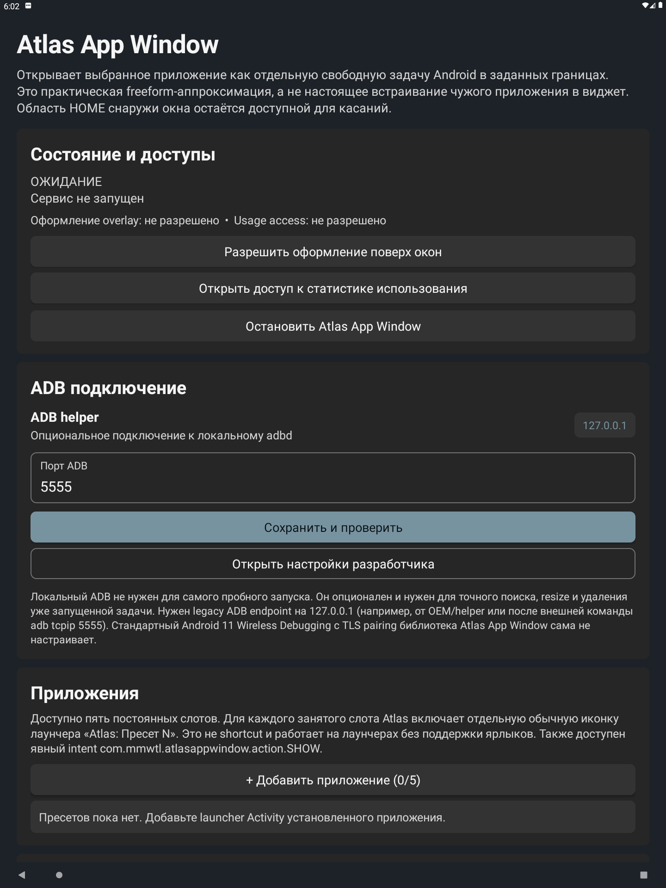
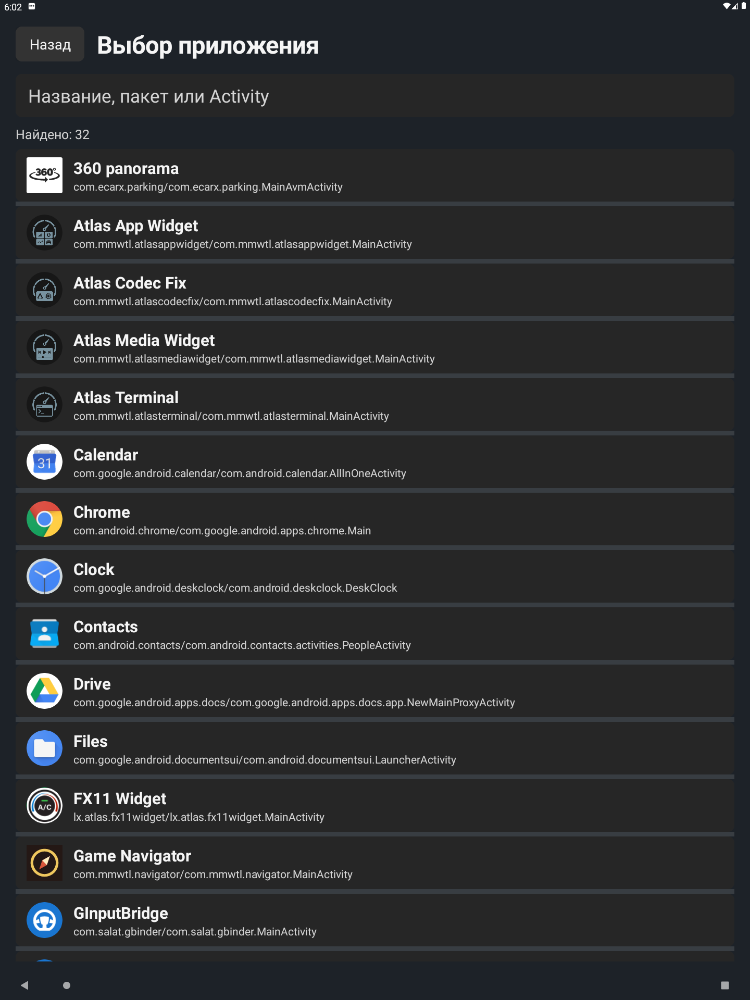
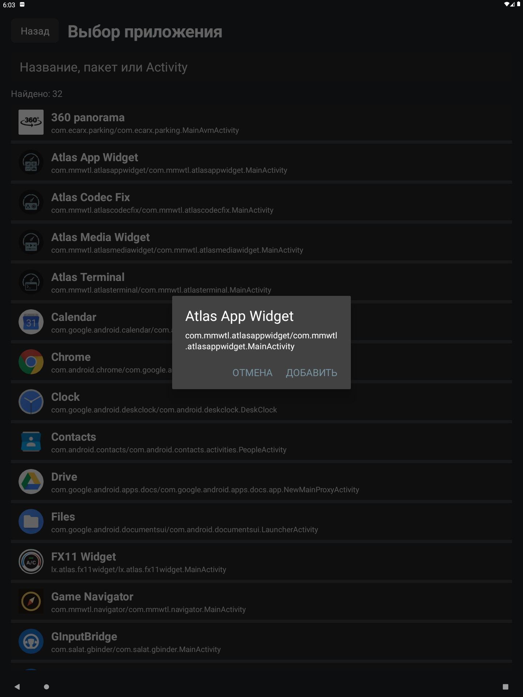

<p align="center">
  
</p>

<h1 align="center">Atlas App Window</h1>

<p align="center">
  Freeform-окно выбранного Android-приложения для портретных автомобильных ГУ
</p>

Atlas App Window запускает выбранную `Activity` как отдельную freeform-задачу Android в заданных
границах экрана. Atlas рисует поверх неё только шапку и элементы управления, а область HOME за
пределами окна остаётся видимой и интерактивной.

> Приложение не встраивает чужую `Activity` внутрь собственного `View`. Обычный sideload APK не
> имеет системных прав для `ActivityView`, поэтому реализация использует freeform task и зависит
> от поддержки freeform в OEM-прошивке.

> [!WARNING]
> Это экспериментальный инструмент для проверенного автомобильного ГУ на Android 11 с экраном
> 1440×1920. Универсальная работа на телефонах, эмуляторах и других OEM-прошивках не заявляется.

## Интерфейс

Главный экран объединяет состояние backend, подключение к опциональному локальному ADB, список
пресетов, живой preview границ окна и настройки шапки, масштаба и поведения.

Основной экран настроек:

<p align="center">
  <a href="docs/images/settings-overview.png">
    
  </a>
</p>

Выбор приложения выполняется через отдельный список доступных `MAIN`/`LAUNCHER` activity с
поиском по названию, пакету и имени Activity. Для каждого пресета Atlas включает отдельную
обычную launcher-иконку «Atlas: Пресет 1…5».

Поверх freeform-задачи Atlas показывает серую шапку или компактную группу кнопок. Оформление
создаётся рядом с задачей и не перекрывает весь экран, поэтому HOME снаружи заданных границ
остаётся доступным.

<table>
  <tr>
    <th>Выбор приложения</th>
    <th>Компактное подтверждение</th>
  </tr>
  <tr>
    <td>
      <a href="docs/images/app-picker.png">
        
      </a>
    </td>
    <td>
      <a href="docs/images/app-confirmation.png">
        
      </a>
    </td>
  </tr>
</table>

Скриншоты сняты на Android 11 AVD и показывают интерфейс; поддержку freeform и поведение HOME
нужно отдельно проверять на целевом OEM-ГУ.

## Возможности

- до пяти пресетов с точным launcher `ComponentName`;
- пять стабильных launcher-слотов без зависимости от pinned/dynamic shortcuts;
- запуск и переключение приложения через Android freeform mode `5` и `ActivityOptions.setLaunchBounds()`;
- настраиваемые отступы `left / top / right / bottom` с живым preview;
- визуально скруглённое окно без явной рамки;
- настраиваемая серая шапка, название приложения и кнопки управления;
- плавающие кнопки «предыдущее / следующее / закрыть», когда шапка скрыта;
- перенос окна за шапку;
- автозапуск сервиса после загрузки ГУ;
- публичные команды `SHOW`, `SWITCH`, `HIDE` только по локально сохранённому preset ID;
- опциональный loopback ADB для проверки task, точного resize и удаления только принятой задачи;
- интерфейс backend для будущей замены freeform на привилегированный `ActivityView`;
- graphite-визуальная система Atlas Media Widget.

## Требования

- Android 11 или новее (`minSdk 30`);
- включённая поддержка freeform windows в прошивке ГУ;
- разрешение «Поверх других окон» для шапки, скругления и кнопок;
- «Доступ к статистике использования» для показа панели только на HOME/целевом приложении;
- для точного контроля уже запущенной задачи — опциональный локальный ADB на `127.0.0.1`
  (по умолчанию порт `5555`).

Если прошивка не объявляет freeform feature, её обычно включают с внешнего ADB и перезагрузкой:

```sh
adb shell settings put global enable_freeform_support 1
adb shell settings put global force_resizable_activities 1
```

Atlas сам не меняет secure/global settings и не требует root. Некоторые OEM-прошивки игнорируют
эти параметры или намеренно отключают freeform.

## Установка и запуск

1. Установите подписанный APK на головное устройство и откройте Atlas App Window.
2. Выдайте разрешения поверх окон и на статистику использования.
3. При необходимости настройте `ADB helper` на `127.0.0.1:5555` и нажмите `Сохранить и проверить`.
   Для пробного прямого запуска ADB не обязателен.
4. В секции приложений нажмите `+ Добавить приложение` и выберите launcher Activity.
5. Настройте границы окна. Значения задаются в физических пикселях, `right` и `bottom` — отступы
   от соответствующих краёв экрана; минимальный размер окна — `220 × 220 px`.
6. Нажмите `Открыть / переключить` у нужного пресета.
7. Для повторного запуска используйте появившуюся обычную иконку «Atlas: Пресет 1…5» или
   постоянную иконку «Atlas: Показать / закрыть».

Команда показа сначала выводит HOME, затем запускает freeform-задачу поверх него. После появления
окна повторно нажимать системную кнопку HOME не нужно: Android 11 может отправить в фон и саму
freeform-задачу.

## Intent API

Прозрачная `CommandActivity` принимает только публичные действия и ID уже сохранённого пресета.
Произвольные package, component и shell-аргументы через этот API не принимаются.

Показать пресет:

```sh
adb shell am start \
  -n com.mmwtl.atlasappwindow/.CommandActivity \
  -a com.mmwtl.atlasappwindow.action.SHOW \
  --es com.mmwtl.atlasappwindow.extra.PRESET PRESET_ID
```

Сменить активное приложение:

```sh
adb shell am start \
  -n com.mmwtl.atlasappwindow/.CommandActivity \
  -a com.mmwtl.atlasappwindow.action.SWITCH \
  --es com.mmwtl.atlasappwindow.extra.PRESET PRESET_ID
```

Скрыть окно:

```sh
adb shell am start \
  -n com.mmwtl.atlasappwindow/.CommandActivity \
  -a com.mmwtl.atlasappwindow.action.HIDE
```

Пять exported launcher aliases не принимают цель извне: каждый жёстко связан со своим локальным
слотом.

## Сборка и проверка

Требуются JDK 17 и Android SDK 36. Используйте Gradle Wrapper из репозитория:

```sh
ANDROID_HOME=/path/to/android-sdk sh gradlew --offline clean check assembleRelease
```

Команда запускает JVM unit-тесты, Android lint и release-сборку. APK создаётся в
`app/build/outputs/apk/release/` с именем вида
`<versionName>[<versionCode>]AtlasAppWindow-release.apk`.

Без локальной release-подписи Gradle создаёт unsigned APK. Подпись подключается через
игнорируемый `secure.signing.gradle`; пример находится в
[`app/secure.signing.gradle.example`](app/secure.signing.gradle.example). Keystore, пароли,
локальный SDK и APK не добавляются в Git.

Для debug-сборки:

```sh
ANDROID_HOME=/path/to/android-sdk sh gradlew --offline assembleDebug
```

## Документация

- [Архитектура и границы платформы](docs/architecture.md);
- [Участие в разработке](CONTRIBUTING.md);
- [Модель угроз и сообщения о проблемах](SECURITY.md);
- [Лицензии сторонних компонентов](THIRD_PARTY_NOTICES.md).

## Совместимость и ограничения

- основной проверенный сценарий — портретное ГУ на Android 11; поведение других прошивок требует
  проверки на реальном устройстве;
- Activity с запретом resize, собственным fullscreen-флагом или несовместимым launch mode может
  проигнорировать заданные границы;
- OEM caption/decor чужого окна контролируется системой, а не Atlas;
- без локального ADB прямой запуск остаётся доступным, но точное восстановление bounds и закрытие
  уже запущенной задачи не гарантируются;
- Atlas не делает `force-stop` чужих приложений и изменяет только task, который положительно связал
  с выбранным компонентом;
- MediaProjection и coordinate input injection не используются: они не дают корректного
  интерактивного embedded-окна;
- результат эмулятора не заменяет проверку на целевом OEM-ГУ.

Подробное сравнение backend-вариантов и чек-лист приёмки находятся в
[docs/architecture.md](docs/architecture.md).

## GSplit и лицензия

[GSplit](https://github.com/Salat39/GSplit) использован как публично доступный референс идеи
`setLaunchBounds + freeform windowingMode`. Код и ресурсы не копировались. В проверенной ревизии
GSplit отсутствует лицензия, поэтому публичная доступность репозитория сама по себе не даёт права
переносить исходники.

Лицензия проекта: [MIT](LICENSE).
